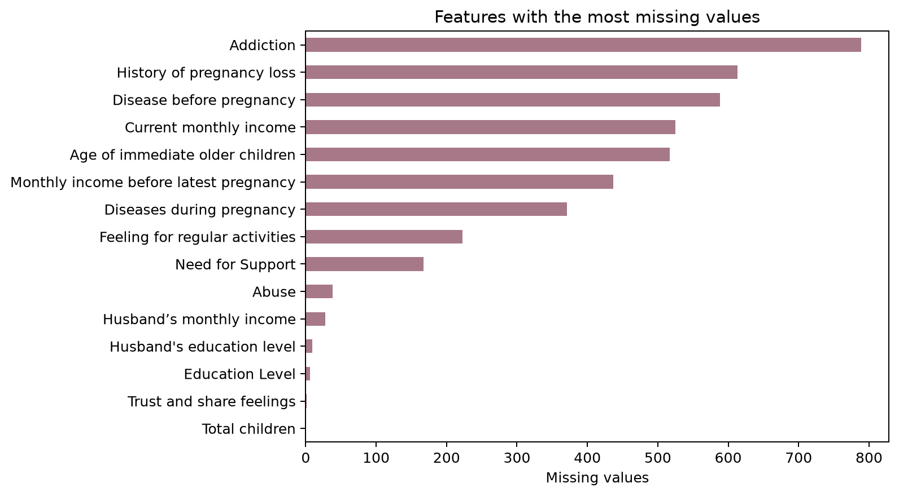
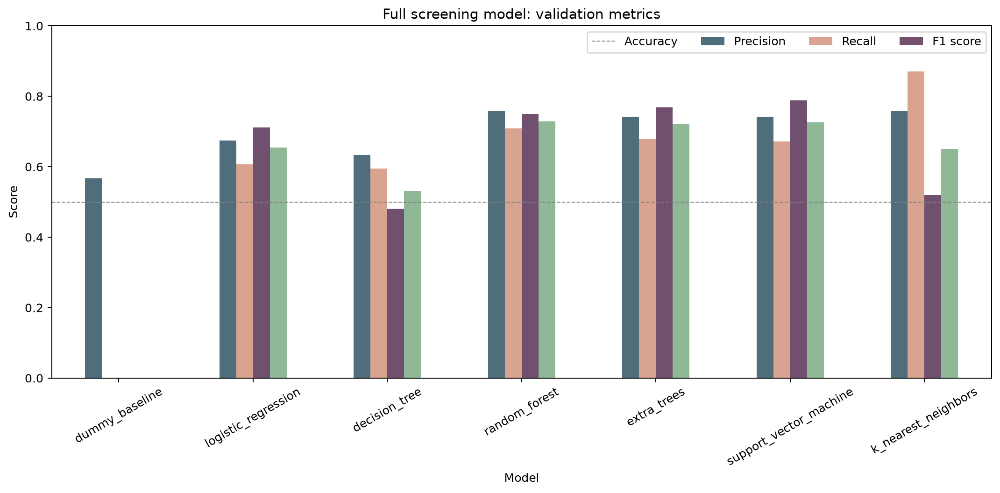
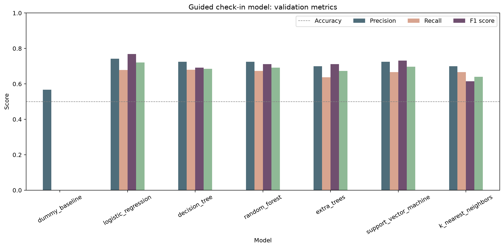

# Umubyeyi

Umubyeyi is a bilingual English/Kinyarwanda postpartum emotional-well-being assistant for first-time
mothers. It combines trained screening-risk classifiers with live SHAP explainability, source-grounded
retrieval, deterministic safety rules, grounded generation (Gemini, with Umubyeyi's own fine-tuned
generator and local retrieval as real fallback layers), a real validated EPDS-10 wellness test, a
client-side progress dashboard, a guided check-in, mood history, and self-care support. It is a research
prototype and does not diagnose or replace a health professional.

## Submission links

- **Deployed application:** https://firstmumassist-six.vercel.app/
- **Five-minute technical demo:** https://www.loom.com/share/957c6c864cd940009977ff87f513b637
- **Repository:** https://github.com/IrutingaboRaissa/UMUBYEYI

Re-verify the production URL is publicly accessible without Vercel authentication immediately before
recording — it redeploys automatically on every push to `main`. The video placeholder must be replaced
after the final commit is deployed and recorded.

## Core functionality

- English and Kinyarwanda emotional-well-being conversations
- deterministic crisis, acute-health, baby-care, and unrelated-topic routing
- same-language character n-gram TF-IDF retrieval across 14 source-attributed topics
- project-trained bilingual six-intent classifier mapped to reviewed evidence topics
- wellbeing answers are generated by Gemini first (reliable in both English and
  Kinyarwanda), answering from general postpartum-wellbeing knowledge rather than being
  constrained to reproduce the project's own 14-topic passages — repeated questions get
  differently-worded, elaborated answers, not the same canned content. Umubyeyi's own
  fine-tuned model (BLOOMZ-560m, LoRA on real ESConv data) is a real, documented fallback
  layer, then optional local Ollama, then the reviewed retrieved passage directly — never
  a broken or empty reply
- multi-turn conversation memory: follow-up messages ("okay, how should I handle this")
  are understood in context instead of being judged in isolation
- Gemini is also used for two low-stakes, non-clinical surfaces — greeting small talk
  and chat-list titles
- generated-output safety validation (length bounds, rejects unverifiable invented
  numbers) with direct-passage fallback if Gemini is unavailable or rejected
- response-path provenance retained in API metadata and evaluation logs, without a user-facing model badge
- optional Ollama phrasing as a secondary local path
- a real, validated EPDS-10 postpartum wellness self-assessment (Cox, Holden & Sagovsky, 1987),
  scored per the licensed dataset's own item-level scoring key
- 15-input guided screening-risk check-in with a non-diagnostic disclaimer
- real SHAP explainability on the check-in risk classifier — computed live from each
  mother's own answers, not a mocked or illustrative chart
- a client-side progress dashboard (EPDS trend, mood check-ins, chat concern trend) —
  everything stays on-device, nothing is sent anywhere
- browser-local mood and conversation history
- self-care guidance, affirmations, feedback, and mobile navigation

## Architecture

```text
Free-text message                         Guided check-in
       |                                        |
Safety and scope rules (history-aware)    15 validated answers
       |                                        |
Language detection                        preprocessing pipeline
       |                                        |
trained intent classifier: category        trained Logistic Regression
       |                                        |
Top-3 knowledge-base matches               non-diagnostic result + live SHAP explanation
       |
Gemini general-knowledge generation (safety-validated, not evidence-constrained)
       |
project-fine-tuned BLOOMZ generation (free-form, own weights) -> local Ollama (dev-only, opt-in)
       |
reviewed retrieved passage (final, always-available fallback)
```

The 800 participant records train screening classifiers. They are never used as chatbot answers.

The project-trained models have distinct responsibilities. The screening classifier estimates the
guided check-in risk category, and its live SHAP explanation is computed from the mother's own
submitted answers each time. The bilingual intent classifier predicts one of six coarse emotional
categories learned from the AMOD-derived weak labels; those categories map to the 14 reviewed
postpartum topics, which the deterministic safety/scope layer uses for routing, citation, and the
fallback answer if generation fails. Retrieval finds the most relevant reviewed passages.

The generation cascade tries Gemini first: it receives only the current message (never raw conversation
history, which can contain sensitive details) and answers from its own general knowledge of postpartum
emotional wellbeing -- deliberately not constrained to reproduce the project's 14-topic passages, so a
repeated question gets a differently-worded, more elaborated answer rather than the same canned content
each time. Its output still passes a lightweight safety check (length bounds, and multi-digit numbers
like phone numbers or dosages are rejected as unverifiable) before use. Gemini was restored to the
primary role after the project's own fine-tuned model proved unreliable mid-conversation in practice;
the fine-tuned model (BLOOMZ-560m, LoRA on real ESConv data, answering freely from its own weights)
remains a real, working fallback layer, not a decorative one, exercised whenever Gemini's answer fails
validation or the API is unavailable. Safety-critical crisis and referral decisions remain fully
deterministic and independent of any generator, in every case -- they run before generation is ever
reached, regardless of what any generator would have said.

The fine-tuned generator was only trained and evaluated on English (see
`models/umubyeyi-bloomz-lora/training_manifest.json`'s `accepted_generation_languages`), but Gemini
handles both English and Kinyarwanda, so Kinyarwanda wellbeing answers are generated too, not limited to
retrieval -- only falling back to the reviewed retrieved passage directly if Gemini's answer fails
validation and the fine-tuned/Ollama layers have no Kinyarwanda support. Conversation history (the last
few turns) is sent from the client and used by the scope router, so a bare follow-up like "okay how
should I handle this" stays in context instead of being judged in isolation.

## Prerequisites

- Windows 10/11, macOS, or Linux
- Python 3.11–3.13
- Node.js 20 or newer and npm
- Git
- enough memory to load the 560M-parameter BLOOMZ-560m base model for local generation (CPU is fine)
- Ollama, optional secondary generation path only

## Installation from a fresh clone

### 1. Clone and enter the repository

```powershell
git clone https://github.com/IrutingaboRaissa/UMUBYEYI.git
cd UMUBYEYI
```

### 2. Create and activate a Python environment

PowerShell:

```powershell
python -m venv .venv
.\.venv\Scripts\Activate.ps1
python -m pip install --upgrade pip
pip install -r requirements.txt
pip install -r requirements-local.txt
```

macOS/Linux:

```bash
python3 -m venv .venv
source .venv/bin/activate
python -m pip install --upgrade pip
pip install -r requirements.txt
pip install -r requirements-local.txt
```

### 3. Install the web dependencies

```powershell
npm ci
```

### 4. Configure the environment

```powershell
Copy-Item .env.example .env.local
```

Analytics are optional. The application uses a local SQLite file when no `DATABASE_URL` is provided.
Create a fresh Gemini API key and put it only in the git-ignored `.env.local` file as
`GEMINI_API_KEY=...`. Never commit or paste a real key into source code, a notebook, or the report.
Without a key, the app safely continues through its local/retrieval paths.

### 5. Fine-tuned local response model

Run `notebooks/umubyeyi.ipynb` on a Colab T4 to produce the current `esconv-v1` LoRA adapter. The
application deliberately refuses to load a superseded adapter trained on templated prompts. After
extracting the artifact under `models/umubyeyi-bloomz-lora/`, Transformers downloads the
`bigscience/bloomz-560m` base checkpoint (decoder-only causal LM) and applies the adapter. This model
generates wellbeing answers freely from its own fine-tuned weights — no evidence conditioning, no
third-party LLM API. Set `UMU_DISABLE_FINETUNED=1` when intentionally testing retrieval fallback.

An earlier `google/mt5-small` (encoder-decoder) LoRA adapter is kept under `models/umubyeyi-mt5-lora/`
as a real architecture-comparison artifact in the notebook, not as the active generator — BLOOMZ was
selected instead because its real training corpus (ROOTS) has confirmed, if small, Kinyarwanda coverage,
and because span-corruption pretraining made the mT5 adapter prone to leaking sentinel-token artifacts.

Optional secondary Ollama path (local-only, opt-in, never a production dependency):

```powershell
ollama pull gemma3:4b
ollama create umubyeyi -f ollama/Modelfile
$env:OLLAMA_MODEL = "umubyeyi"
$env:UMU_ENABLE_OLLAMA = "1"
```

`ollama create` applies project instructions and does not fine-tune Ollama weights. This is distinct
from the BLOOMZ LoRA adapter, whose trainable weights were updated by this project. If the fine-tuned
generator does not return an answer (for example, a non-English message, since the checkpoint was only
trained and evaluated on English), the application falls back to Ollama (if enabled) and finally to the
reviewed retrieved passage.

Gemini is intentionally scoped to two low-stakes, non-clinical surfaces only: greeting small talk
(`generate_social`) and chat-list titles (`generate_title`). It never produces wellbeing-answer content
and is not described as project-fine-tuned — it is an external inference component, used only where a
third-party model's output carries no factual or safety weight. The verified default is
`gemini-3.1-flash-lite`; it can be changed with `GEMINI_MODEL`. If Gemini is unavailable, the app returns
a plain availability notice for greetings; wellbeing answers are entirely unaffected either way.
Fixed application text is restricted to safety, clinical referral, scope redirection, disclaimer, and
failure handling. These controls are intentionally deterministic and are not presented as learned output.

### 6. Start the complete local application

```powershell
npm run dev
```

`npm run dev` starts both the Next.js interface and local Python API adapter. Open the URL printed by
Next.js, normally http://localhost:3000. If port 3000 is occupied, it selects another port.

## Verification

### Automated tests

```powershell
python -m pytest -q
```

Current verified result: **86 tests passed**. Strategies include unit, parameterized, boundary-value,
invalid-input, offline/fallback, bilingual retrieval, safety, response-contract, dependency-injection,
HTTP integration, indirect/obfuscated crisis messages, multi-turn conversation continuity (a bare
follow-up stays in scope; an explicit off-topic pivot still redirects mid-conversation), grounded-Gemini
coverage/evidence validation with retry, fallback-cascade ordering (Gemini -> fine-tuned -> Ollama ->
retrieval), Gemini greeting/title failure fallback, generation-data leakage control, SHAP explanation
shape/fallback, layered-evaluation integrity, and
generated-output validation.

### Layered model evaluation

```powershell
python scripts/evaluate_system_layers.py
```

No single accuracy score describes the system because classification, retrieval, generation, and
safety routing are different tasks. The command writes auditable cases, JSON metrics, and figures to
`reports/system_evaluation/`.

| Layer | Evaluation evidence | Primary result |
|---|---|---:|
| Full screening classifier | 120 untouched participant rows | F1 0.7890 |
| Practical check-in classifier | 120 untouched participant rows | F1 0.7544 |
| Bilingual intent classifier | 180 untouched bilingual cases | English macro-F1 0.7180; Kinyarwanda 0.2762* |
| English question-to-topic retrieval | 14 controlled paraphrases | Top-1 0.6429; Top-3 0.9286 |
| Kinyarwanda question-to-topic retrieval | 14 controlled project-authored cases | Top-1 1.0000* |
| ESConv generator (BLOOMZ-560m, fine-tuned) | conversation-grouped, 100-example held-out test | ROUGE-L F1 0.1285 (base 0.0648) |
| Safety/scope routing | 16 controlled cases across five categories | Accuracy 1.0000* |

`*` Controlled results are software/behavior evidence, not real-user or clinical validity. The
Kinyarwanda retrieval cases share domain vocabulary with the knowledge bank and require native review,
so their perfect score must not be presented as proof of generalization. English Top-1 performance also
shows that the lexical retriever can confuse indirect paraphrases even when the right topic is usually
within its Top-3 results.

### Project-trained intent classifier

```powershell
python scripts/train_topic_classifier.py
```

The persisted `models/topic_classifier.joblib` pipeline combines word and character TF-IDF with the
best of seven probabilistic classifiers. It uses 596 deduplicated bilingual question pairs derived
from `Amod/mental_health_counseling_conversations`: 417 train, 89 validation, and 90 untouched test
rows. English and Kinyarwanda versions always remain in the same split. The labels are keyword weak
labels and the Kinyarwanda text is NLLB-200 machine translation, so the scores measure reproduction of
project labels rather than clinical validity. Runtime maps the Top-3 coarse intents to reviewed
postpartum evidence topics.

The unified notebook also prepares a zero-shot NLLB translation-pivot experiment using
`facebook/nllb-200-distilled-600M` (`kin_Latn` ↔ `eng_Latn`). It compares direct Kinyarwanda intent
classification with Kinyarwanda-to-English translation followed by classification and exports cases
for native-speaker review. NLLB fine-tuning remains gated on independently sourced or human-corrected
parallel data; retraining NLLB on its own cached translations would be circular. The official
[Hugging Face NLLB documentation](https://huggingface.co/docs/transformers/en/model_doc/nllb) is
recorded in `docs/REFERENCES.md` for the final report.

Automatic text metrics cannot establish whether a response is empathetic, natural, or culturally
appropriate. The Colab artifact `generator_human_review_cases.csv` contains held-out
outputs and blank 1–5 review fields for relevance, fluency, empathy, grounding, safety, and language
correctness. Scores must only be reported after named reviewers complete the sheet; blank fields are
deliberately not replaced with model-generated ratings.

### Production build

```powershell
npm run build
npm run start
```

The current Next.js production build completes successfully.

### Reproduce model training

```powershell
python scripts/train_ppd_classifier.py
python scripts/train_checkin_classifier.py
python scripts/train_grounded_generator.py
```

These commands regenerate the screening pipelines and the mT5 architecture-comparison generator (the
`scripts/train_grounded_generator.py` script trains `google/mt5-small`, not the active BLOOMZ generator). Use
`--smoke` only to verify the pipeline quickly; the reported metrics come from the complete run. The
tabular PPD participant data is never used as generator supervision.

The project now has one end-to-end notebook: `notebooks/umubyeyi.ipynb`, which trains the **active**
BLOOMZ-560m generator (`models/umubyeyi-bloomz-lora/`) as well as the mT5 comparison point. Open it in
Google Colab, select **Runtime -> Change runtime type -> T4 GPU**, and choose **Runtime -> Run all**. It
clones the project data automatically and runs data auditing, missing-value preprocessing, seven-model
classifier comparisons, confusion matrices, explainability, bilingual retrieval, both generators'
LoRA fine-tuning, loss curves, held-out evaluation, and artifact export. No API key or manual
knowledge-file upload is required. The downloaded zip contains the fitted pipelines, both LoRA adapters,
metrics, loss history, and English/Kinyarwanda human-review cases.

### Performance benchmark

```powershell
python scripts/benchmark_system.py
```

The command records OS, Python version, processor, logical CPU count and 100-run latency summaries in
`reports/performance/local_benchmark.json`. Run it on a second machine or operating system before the
defense and retain both result files for cross-environment evidence.

Current Windows 11 / Python 3.13.7 / 8-logical-CPU medians (real fine-tuned BLOOMZ generation on CPU,
not a fallback-only measurement — see `reports/performance/local_benchmark.json`):

| Runtime path | Median latency |
|---|---:|
| Crisis safety routing | 0.008 ms |
| Greeting (Gemini disabled/unavailable, fallback text) | 0.011 ms |
| English message (real fine-tuned BLOOMZ generation) | 5243.5 ms |
| Kinyarwanda message (direct retrieval, no generation) | 159.1 ms |
| Guided check-in prediction + live SHAP explanation | 1167.2 ms |

English responses are slow here specifically because this environment runs the real fine-tuned
BLOOMZ-560m model on CPU rather than falling back to retrieval — the multi-second cost of genuine local
generation, not a regression. Kinyarwanda stays fast because it is answered by direct retrieval (no
generator is trained for Kinyarwanda yet). These numbers exclude Gemini network and Ollama generation
latency, since neither runs in this configuration. Repeated runs on the same machine vary by roughly
20-100% on the generation-dependent paths (CPU load, thermal state, background processes) — this is
expected variance for a CPU-bound generation workload, not a bug; treat these as one representative
run, not an exact reproducible constant.

## Supervised machine-learning experiments

The licensed dataset contains 800 postpartum participant records from Bangladesh: Raisa and Kaiser,
*Data for Postpartum Depression Prediction in Bangladesh*, Mendeley Data version 3,
DOI `10.17632/4nznnrk8cg.3`, CC BY 4.0.

The binary target is elevated EPDS screening risk: High versus Low/Medium. All concurrent EPDS/PHQ
items, totals, and derived labels are excluded to prevent target leakage.

### Data preparation and missing values

The raw file contains 800 rows, 70 columns, no duplicate rows and 4,312 missing cells. Rows with
missing predictors were not discarded, because doing so would unnecessarily reduce an already modest
dataset. Preprocessing is part of each scikit-learn `Pipeline`:

1. The target is converted to `elevated` for EPDS High and `not_elevated` for EPDS Low/Medium.
2. The identifier, target, concurrent questionnaire items, totals and derived results are removed to
   prevent target leakage, leaving 46 predictors for the full experiment.
3. The data is stratified into 560 training, 120 validation and 120 untouched test rows before any
   imputation is learned.
4. Numeric predictors use median imputation followed by standardisation.
5. Categorical predictors use most-frequent imputation followed by one-hot encoding. Unknown test or
   production categories are ignored safely, and categories seen fewer than twice are grouped.
6. Each candidate pipeline learns its imputation values, scaling values and category vocabulary only
   from its training input. The untouched test data therefore cannot influence preprocessing or model
   selection.
7. After validation F1 selects the winning algorithm, that configuration is refitted on training plus
   validation rows and evaluated once on the test set.



- stratified split: 560 training / 120 validation / 120 untouched test
- seed: 42
- candidates: Dummy, Logistic Regression, Decision Tree, Random Forest, Extra Trees, SVM, and KNN
- selection: validation F1-score for the `elevated` class

### Full 46-predictor model comparison — validation set

| Candidate | Accuracy | Precision | Recall | F1 |
|---|---:|---:|---:|---:|
| Dummy baseline | 0.5667 | 0.0000 | 0.0000 | 0.0000 |
| Logistic Regression | 0.6750 | 0.6066 | 0.7115 | 0.6549 |
| Decision Tree | 0.6333 | 0.5952 | 0.4808 | 0.5319 |
| **Random Forest — selected** | **0.7583** | **0.7091** | **0.7500** | **0.7290** |
| Extra Trees | 0.7417 | 0.6780 | 0.7692 | 0.7207 |
| Support Vector Machine | 0.7417 | 0.6721 | 0.7885 | 0.7257 |
| K-Nearest Neighbors | 0.7583 | 0.8710 | 0.5192 | 0.6506 |



### Reduced 15-input check-in comparison — validation set

| Candidate | Accuracy | Precision | Recall | F1 |
|---|---:|---:|---:|---:|
| Dummy baseline | 0.5667 | 0.0000 | 0.0000 | 0.0000 |
| **Logistic Regression — selected** | **0.7417** | **0.6780** | **0.7692** | **0.7207** |
| Decision Tree | 0.7250 | 0.6792 | 0.6923 | 0.6857 |
| Random Forest | 0.7250 | 0.6727 | 0.7115 | 0.6916 |
| Extra Trees | 0.7000 | 0.6379 | 0.7115 | 0.6727 |
| Support Vector Machine | 0.7250 | 0.6667 | 0.7308 | 0.6972 |
| K-Nearest Neighbors | 0.7000 | 0.6667 | 0.6154 | 0.6400 |



### Selected models — untouched test set

| Experiment | Selected model | Accuracy | Precision | Recall | F1 |
|---|---|---:|---:|---:|---:|
| Full 46-predictor research model | Random Forest | 0.8083 | 0.7679 | 0.8113 | 0.7890 |
| Reduced 15-input check-in | Logistic Regression | 0.7667 | 0.7049 | 0.8113 | 0.7544 |

These are held-out experimental results, not clinical validation.


## Fine-tuned free-form generator

The current notebook fine-tunes `bigscience/bloomz-560m` (decoder-only causal LM) with LoRA on genuine
conversational targets rather than generated templates:

- **ESConv:** original supporter turns from 1,300 emotional-support conversations, capped at six
  supporter turns per conversation. Official commit
  `f262d062ad74cb39b17ea476facc81568ddcba24`; academic research use only.
- **Postpartum knowledge base:** 14 reviewed English/Kinyarwanda topics used only by the deterministic
  safety/scope layer for routing and citation. It is not expanded into templated training conversations,
  and the generator is not conditioned on it at inference time — it answers freely, the way a
  general-purpose fine-tuned LLM would.

Complete ESConv conversations are assigned to one split, preventing turns from crossing training and
evaluation. The notebook evaluates the base and fine-tuned model with held-out ROUGE-L, Distinct-2,
loss curves, and blank human-review fields:

| | ROUGE-L F1 | Distinct-2 | Mean response words |
|---|---:|---:|---:|
| Base BLOOMZ-560m | 0.0648 | 0.8074 | 7.23 |
| Fine-tuned BLOOMZ-560m | 0.1285 | 0.6912 | 17.29 |

An earlier `google/mt5-small` (encoder-decoder) LoRA adapter is also trained in the same notebook as a
real architecture-comparison point (see `models/umubyeyi-mt5-lora/`), not as the active generator.

The conversational dataset is English and is not postpartum-specific. Consequently, the trained
generator is presented as an English emotional-support adaptation, not a bilingual clinical model — its
`training_manifest.json` restricts `accepted_generation_languages` to English accordingly. The
AMOD-derived file under `data/intent/` is separate project data used only to train the bilingual intent
classifier (see below); it supplies no generator targets and no Kinyarwanda answer targets. No human-
authored Kinyarwanda conversational corpus exists yet, so Kinyarwanda wellbeing answers come directly
from the reviewed retrieved passage — not generation, and not a third-party LLM. Gemini is used
elsewhere in the app only for greeting small talk and chat titles, and is disclosed as an external model.

### Data provenance

Detailed source, license, version, transformation, and checksum information is stored in
`data/external/README.md` and `data/intent/README.md`. ESConv is downloaded from its official
repository at runtime and verified with SHA-256. The repository does not redistribute the corpus.

## Deployment plan

### Generation: Gemini on both local and deployed, the fine-tuned fallback is local-only

Gemini is the primary generator everywhere, so the deployed build's chat behaves like local for both
English and Kinyarwanda. The one real difference is the fallback layer if Gemini's answer fails
validation or the API is unavailable: locally that can be the real fine-tuned BLOOMZ model or Ollama;
on Vercel it falls straight to the reviewed retrieved passage, because the `bigscience/bloomz-560m` base
checkpoint plus PyTorch/Transformers/PEFT don't fit the 500 MB standard Python function bundle limit
(the LoRA adapter itself is compact, ~3 MB, but it needs the full base model loaded alongside it). See
the [Vercel Python runtime limits](https://vercel.com/docs/functions/runtimes/python). Vercel's large
Functions (up to 5 GB on Fluid Compute, introduced June 2026) make this no longer categorically
impossible, but enabling it now would be an untested architecture change this close to submission, so
the fine-tuned model stays the reproducible local/Colab fallback path.

### Why SHAP explainability is local-only

`shap`'s own hard dependencies (`numba`, `llvmlite`) pushed the deployed bundle to 542 MB, over Vercel's
500 MB limit, even after every other function-size fix. Rather than risk the whole deployment to keep one
feature, `shap` was removed from the root `requirements.txt` (it stays in `requirements-local.txt` for
local dev and the Colab notebook). `src/explain.py` already gated SHAP off on Vercel by default before
this (`UMU_ENABLE_SHAP=1` opt-in) and imports it lazily inside a try/except, so this fails closed cleanly:
the deployed check-in still returns its non-diagnostic result, just with `explainability_available: false`
and no chart — not a crash.

This is presented as documented, not a hidden gap: **local** (`npm run dev`) additionally has the real
fine-tuned BLOOMZ fallback and the live SHAP explanation; **deployed** (Vercel) has real Gemini-grounded
chat in both languages, but falls straight to the retrieved passage instead of the fine-tuned model if
Gemini fails, and has no SHAP chart on the check-in result — everything else (EPDS test, progress
dashboard, safety routing) runs identically in both.

1. Run tests and the production build locally.
2. Commit and push the exact tested revision.
3. Import the GitHub repository into Vercel.
4. Configure optional `DATABASE_URL` in project environment variables.
5. Deploy using `vercel.json`; set a fresh `GEMINI_API_KEY` in project environment variables (this is
   what actually generates wellbeing answers in both languages — without it, the deployed app still works,
   falling back to the reviewed retrieved passage for every message).
6. Verify `/`, `/api/chat`, `/api/screen`, crisis routing, English/RW generation, EPDS test, progress
   dashboard, and mobile layout. On the deployed build, confirm `/api/screen` still returns a clean
   result with `explainability_available: false` (no SHAP chart) rather than an error.
7. Confirm that the URL at the top of this README is publicly accessible without Vercel authentication.
8. Record the demo against that exact deployed revision.

## Five-minute demonstration plan

1. Problem, intended user, and strict emotional-well-being scope — 25 seconds
2. Dataset, split, seven algorithms, and selected metrics — 35 seconds
3. Chat: an English message, a follow-up ("okay how should I handle this") staying in context, then an
   explicit off-topic pivot correctly redirecting mid-conversation — 45 seconds
4. Chat: a Kinyarwanda message, real generated reply, plus crisis and baby-care routing — 45 seconds
5. Guided check-in with varied inputs and its non-diagnostic result, run locally to also show its live
   SHAP explanation computed from those exact answers — 40 seconds
6. EPDS-10 wellness test (a real validated instrument, not invented) and the progress dashboard
   trend — 35 seconds
7. The check-in with vs without its SHAP chart (local vs deployed) — the one remaining documented
   cross-environment difference — 35 seconds
8. Tests, benchmark, honest limitations (fine-tuned fallback quality, Kinyarwanda fallback not yet
   possible), and recommendations — 40 seconds

Do not focus the video on authentication or visual styling; demonstrate algorithms, varied data,
failure handling, safety, and evidence.

## Repository map

```text
api/                              deployment Python endpoints
app/, components/, lib/           Next.js user interface
components/EpdsAssessment.tsx     EPDS-10 wellness test UI (item-by-item, crisis-aware)
components/ProgressDashboard.tsx  client-side trend dashboard (EPDS, mood, concern signal)
components/charts/                shared Recharts trend/bar-chart components
lib/epds.ts                       EPDS-10 items, scoring, band classification, streak tracking
data/postpartum_depression/       licensed participant data and dictionary
data/intent/                      AMOD-derived weak labels and machine translations
data/translation/                 schema and review gate for NLLB parallel fine-tuning data
data/external/                    pinned ESConv provenance (corpus downloaded at runtime)
data/knowledge/                   bilingual source-attributed grounding collection
models/                           fitted language and screening pipelines
models/umubyeyi-bloomz-lora/      active project-trained LoRA adapter and training manifest
models/umubyeyi-mt5-lora/         earlier architecture-comparison LoRA adapter (not the active generator)
models/ppd_checkin_shap_background.csv  SHAP background sample (training-split rows only)
notebooks/umubyeyi.ipynb          unified Colab ML, retrieval, fine-tuning, and evaluation workflow
ollama/Modelfile                  local response-model instructions
reports/                          metrics, figures, and performance evidence
docs/REFERENCES.md                technical sources reserved for the final report bibliography
scripts/                          standalone training/eval/benchmark scripts (not runtime imports)
scripts/train_grounded_generator.py  reproducible ESConv LoRA fine-tuning (mT5 comparison path)
scripts/evaluate_system_layers.py    layered metrics, auditable cases, and consolidated figures
scripts/build_shap_background.py     builds the SHAP background sample from the training split
src/generation_data.py            generator dataset construction and grouped splits
src/finetuned_generator.py        lazy BLOOMZ inference — free-form generation, own weights
src/gemini_generator.py           Gemini scoped to greeting small talk and chat titles only
src/explain.py                    lazy SHAP explainer for the check-in risk classifier
src/rag.py                        conversational pipeline, safety policy, multi-turn scope routing
src/screening.py                  OOP check-in service
src/visualizations.py             OOP experiment visualizer
tests/                            automated unit and integration tests
local_api.py                      OOP local HTTP adapter
scripts/benchmark_system.py       reproducible runtime benchmark
```

## Limitations and responsible use

- The participant data is from Bangladesh, covers up to 24 months postpartum, and is not restricted
  to first-time mothers; it cannot validate performance for the intended Rwandan population.
- The system estimates screening risk, not diagnosis.
- The 14-topic grounding collection is deliberately focused and should be expanded with permitted,
  Rwanda-relevant evidence.
- Project-produced Kinyarwanda passages require native-speaker and maternal-health review.
- No reviewed Kinyarwanda gold evaluation set or formal Rwandan user study has been completed.
- ESConv provides genuine English generator targets but is neither postpartum-specific nor Rwandan;
  its use teaches general response behaviour rather than clinical or local validity. AMOD supplies only
  the bilingual intent-classifier training data, not generator targets.
- The intent labels are keyword weak labels, and the cached Kinyarwanda questions are NLLB-200 machine
  translations. The untouched Kinyarwanda macro-F1 is 0.2762 and requires substantial improvement.
- No human-authored Kinyarwanda response corpus is used for the project's own generator fine-tuning, so
  that fallback layer only covers English (see `accepted_generation_languages` in the training manifest).
  Kinyarwanda wellbeing answers are still generated, by Gemini, and fall back to the reviewed retrieved
  passage directly (not the fine-tuned model) if Gemini's answer fails validation.
- At 560M parameters and ~7,800 fine-tuning examples, the fine-tuned fallback's own English output
  quality is real but modest (ROUGE-L 0.1285) — occasionally topically present but tonally imperfect,
  especially on later conversation turns. This is exactly why Gemini is the primary generator rather
  than this checkpoint: in practice, the small model was unreliable mid-conversation.
- Gemini is an externally hosted model, used as the primary generator for wellbeing answers in both
  languages, plus greeting small talk and chat titles. Its wellbeing answers are deliberately general
  knowledge, not constrained to the project's own 14-topic passages (the chatbot is one supporting
  feature among several, not the capstone's centerpiece, and narrow evidence-constrained answers read as
  repetitive across repeated questions). A lightweight safety check still rejects unverifiable invented
  numbers (phone numbers, dosages) and overly short responses. Sending a message to it requires clear
  user disclosure, data minimization, secure key handling, and documented API availability/cost.
- The optional Ollama model remains pretrained and instruction-configured, not fine-tuned.
- The fine-tuned generator does not run in the deployed (Vercel) build — see "Deployment plan" — so if
  Gemini's answer fails validation there, the hosted chat falls to the retrieved passage directly rather
  than the fine-tuned model; the local build is where the real fine-tuned fallback runs.
- SHAP explainability also does not run in the deployed build (its `numba`/`llvmlite` dependencies
  pushed the bundle past Vercel's 500MB limit) — see "Deployment plan"; the deployed check-in returns
  its result with `explainability_available: false`, and the local build is where the live SHAP chart runs.
- Deterministic safety rules may miss novel paraphrases and do not replace emergency assessment.
- The EPDS-10 wellness test is presented in English only; no validated Kinyarwanda translation of the
  instrument exists yet, and an unverified translation would not be presented as equivalent.

Future work should prioritize ethical Rwanda-specific data collection, professional and native-speaker
review, usability testing, model calibration, fairness analysis, multilingual semantic retrieval, a
human-authored Kinyarwanda conversational corpus so the project's own generator can cover Kinyarwanda
too, a validated Kinyarwanda EPDS-10 translation, and hosting the fine-tuned generator (for example via
a paid always-on host, since free-tier Hugging Face Spaces storage limits ruled that out during this
project) so its fallback also runs in the deployed build.

## Safety notice

Umubyeyi provides general educational and emotional-support information only. It is not emergency or
medical care. Crisis wording, acute physical symptoms and possible postpartum psychosis bypass the
ordinary conversational path and direct the user to immediate human support.
