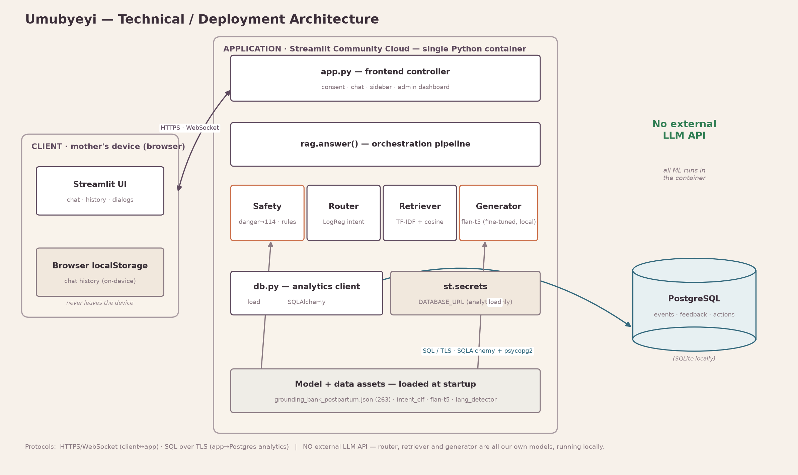

# Umubyeyi

**A bilingual (Kinyarwanda / English) companion for the emotional wellbeing of first-time mothers in Rwanda during the 0-6 month postpartum window - every answer generated by our own locally-trained model, with no external LLM API.**

### 🎥 [Demo video (5-min walkthrough)](https://drive.google.com/file/d/144gI9wkDh3voYUJjtKdA2V9lA9tSV1fz/view?usp=drive_link)
### 🚀 [Live app - Hugging Face Space](https://huggingface.co/spaces/Irutingabo/UMUBYEYI)

Author: **Raissa IRUTINGABO** · Supervisor: **Samiratu Ntoshi** · BSc Software Engineering, African Leadership University

---

## Why this project

In Rwanda, antenatal care is comparatively well-attended and most deliveries are supervised, but **postnatal contact drops sharply after birth**. Yet the **0–6 months after birth** is exactly when **postpartum depression, anxiety, loneliness, and emotional exhaustion** peak. First-time mothers are the most exposed, and they often lack timely, trustworthy **emotional** support **in Kinyarwanda**. Umubyeyi focuses on that gap — a mother's mental wellbeing — rather than answering clinical or baby-care questions (which it refers to a health worker).

---

## What it does

You type how you feel in **Kinyarwanda or English**, and Umubyeyi replies **in the same language** with a warm, non-diagnostic response grounded in a validated counselling knowledge base — wrapped in safety mechanisms.

- **Our own model generates the answers.** English replies are written by a **fine-tuned `flan-t5-base` model we trained** on our validated postpartum bank — not a commercial API, not fixed templates.
- **Bilingual and auto-detected** — each message is detected and answered in its own language.
- **Emotional focus** — sadness, anxiety, feeling overwhelmed, loneliness, guilt, identity change, exhaustion, bonding difficulty, coping.
- **Grounded** — the generator writes from validated counselling content, so it can't fabricate advice.
- **Stays in its lane** — clinical/baby-care questions (feeding, fever, bleeding) are **warmly referred to a health worker**, not answered.
- **Safety first** — a deterministic danger-sign override surfaces a crisis referral (Rwanda's **114** line); every answer carries a disclaimer; off-topic questions are politely redirected.
- **On-device chat history**, a **Breathe** guided-breathing action, and a **Help** action with crisis contacts.

---

## System architecture

Umubyeyi is a **fully local, retrieval-augmented-generation (RAG)** system. **Every machine-learning component is our own and runs in-process — there is no external LLM API.** Safety-critical logic is deterministic and independent of the model, so a model issue can never bypass the crisis path or the disclaimer.



### Layers, responsibilities, and technologies

| Layer | Responsibility | Key modules | Technology |
|---|---|---|---|
| **Presentation** | Welcome/consent, chat, collapsible history, Breathe & Help dialogs | `src/app.py` | Streamlit 1.48, browser `localStorage` |
| **Orchestration** | Drive the pipeline; decide the response *mode* | `rag.answer()` | Python 3 |
| **Safety (cross-cutting)** | Deterministic danger detection, clinical referral, disclaimer, scope | `is_danger()`, `is_clinical()`, `_crisis_message()`, `DISCLAIMER` | keyword rules |
| **Language** | Detect EN vs RW to choose the reply language | `detect_language()`, `models/lang_detector.joblib` | char n-gram TF-IDF + **Logistic Regression** |
| **Intent router** | Tag the wellness intent | `route_intent()`, `models/intent_clf.joblib` | word+char TF-IDF + **Logistic Regression** (6 intents) |
| **Retrieval** | Find the closest validated counselling snippet | `retrieve()`, `data/grounding_bank_postpartum.json` (178 pairs) | TF-IDF `char_wb` (3–5) + cosine similarity |
| **Generation (LOCAL)** | Write the English answer, grounded on the snippet | `_generate_en()`, `models/umubyeyi-generator/` | **fine-tuned `flan-t5-base`** (our weights) |

### Request lifecycle

`rag.answer(query, force_lang=None, history=None)` runs a deterministic pipeline:

1. **Language** — `force_lang` if pinned, else `detect_language()` → `"en"`/`"rw"`.
2. **Safety short-circuit** — `is_danger()` → `_crisis_message()` (referral to **114**) *before any model/retrieval*. Unconditionally reachable.
3. **Greeting / small-talk** → a varied warm greeting.
4. **Clinical/baby-care** (`is_clinical()`) → a warm referral to a health worker.
5. **Intent + retrieval** — `route_intent()` (our LogReg) tags the intent; `retrieve()` scores the query (char-`wb` TF-IDF + cosine) against the 178-pair bank and returns the top matches.
6. **Grounding gate** — below `SIM_GATE` (0.25) the system asks the mother to say more (never fabricates).
7. **Generation** — **English:** our fine-tuned `flan-t5-base` generates the answer, grounded on the retrieved notes (beam decoding); if generation fails, the validated answer is a fallback. **Kinyarwanda:** served from the validated Kinyarwanda text (the generator is English-only).
8. **Disclaimer** — the canonical disclaimer for the reply language is appended once.

### Response contract

```python
{
  "answer":   str,            # text shown to the mother (+ disclaimer)
  "language": "en" | "rw",
  "danger":   bool,           # True only on the crisis path
  "grounded": bool,           # True if a validated snippet met the gate
  "mode":     "generative" | "retrieved" | "retrieved_rw" | "greeting"
              | "referral" | "safety" | "clarify",
  "intent":   str | None,     # LogReg wellness-intent tag
  "sources":  [{"topic": str, "source": str, "sim": float}, ...]
}
```

### Data — the validated postpartum bank

`data/grounding_bank_postpartum.json` — **178 emotional-wellbeing pairs**, each `{source, topic, question_en, answer_en, question_rw, answer_rw}`:

- **MOTHER** (Eyobu et al., *BMC Research Notes*, 2025; Harvard Dataverse `10.7910/DVN/EZLCH3`; CC BY 4.0) — clinician-validated maternal Q&A (data source: Uganda), filtered to postpartum-emotional items (bilingual).
- **maternalcareeng** (`nashrah18/maternalcareeng`, HF, MIT) — maternal/postpartum Q&A.
- **Curated from authoritative bodies** — NHS (postnatal depression, baby blues) and Postpartum Support International, adapted to the Rwanda context; strictly emotional wellbeing.

Clinical/baby-care and pregnancy items are pruned out — those are referred to a health worker.

---

## Results

- **Generator (deployed `flan-t5-base`)** on the held-out split (`reports/generator_eval.json`): **ROUGE-1 0.27, BLEU 5.8**, best validation cross-entropy **~2.98** with **early stopping** (loss curve: `reports/figures/generator_loss_curve.png`). n-gram scores are modest by design — the model *paraphrases* validated text rather than copying it — which is why the qualitative trace (see the notebook) is the primary quality evidence.
- **Language detector** — char-n-gram LogReg, ~99.9% accuracy.
- **Intent classifier comparison** (6-intent task, retained as analysis): classical models (Random Forest macro-F1 0.71, LogReg 0.65) beat a fine-tuned AfriBERTa (0.44) in this low-resource setting; and machine translation degrades performance (EN 0.72 → RW 0.56). This motivated the RAG-with-grounding design.

---

## Repository structure

```
src/
  app.py            Streamlit frontend: consent, chat, history panel, dialogs, typing indicator
  rag.py            core pipeline: language -> safety -> router -> retrieve -> flan-t5 generate -> disclaimer
  db.py             anonymous analytics/feedback datastore (Postgres or SQLite)
data/
  grounding_bank_postpartum.json   178 validated postpartum emotional-wellbeing Q&A (the bank)
  mother/                          MOTHER postpartum subset (bilingual)
  raw/amod_full.csv                counselling corpus (used to train the intent classifier)
notebooks/
  umubyeyi.ipynb    full analysis: data -> classifier -> experiments -> flan-t5 fine-tune -> eval -> demo
models/
  lang_detector.joblib             EN/RW detector (in repo)
  intent_clf.joblib                LogReg intent router (in repo)
  umubyeyi-generator/              fine-tuned flan-t5-base (NOT in git; see "Get the model")
tests/                             pytest suite (safety, routing, language, response modes)
reports/                           metrics + figures (loss curve, ROUGE/BLEU)
train_local.py                     train the classifier + generator locally
eval_generator.py                  ROUGE/BLEU + behaviour eval of the deployed generator
assets/system_architecture_layered.png
```

---

## Install & run locally

```bash
pip install -r requirements.txt
streamlit run src/app.py     # opens http://localhost:8501
```

No API keys are required — everything runs locally.

### Get the model

The fine-tuned generator (`models/umubyeyi-generator/`, ~945 MB) is **not in git** (GitHub's 100 MB limit). Two ways to obtain it:

1. **Download** the pre-trained model from the Hugging Face Space (Files tab) or the GitHub Release, and unzip so `models/umubyeyi-generator/` exists at the repo root; **or**
2. **Regenerate it** — `python train_local.py` trains the intent classifier + generator locally (GPU recommended; a Colab/Kaggle cell is in `notebooks/umubyeyi.ipynb`).

**Without the model, the app still runs** — it returns the validated answers via retrieval (no crash), so it degrades gracefully.

---

## Testing

```bash
pip install pytest
pytest -q
```

`tests/` covers multiple strategies: **deterministic safety** (self-harm → 114; clinical → referral), **routing** (greeting/small-talk, off-topic), **language detection** (EN/RW), **response-mode contract**, and **an "answer never calls an external API" guard**. Generation quality is measured separately in `eval_generator.py` (ROUGE/BLEU on held-out data) and the notebook. Performance across hardware: the app runs on CPU locally (~2–5 s/answer with the base model); the generator was fine-tuned on a Kaggle T4 GPU (~10 min) vs. hours on CPU.

---

## Deployment

Deployed as a **Hugging Face Space** (Streamlit SDK) — HF provides enough RAM for the `flan-t5-base` model and hosts the weights alongside the app (via Git LFS), so the deployed app runs the real generator, not the fallback. The Space is configured by the frontmatter at the top of this README (`sdk: streamlit`, `app_file: src/app.py`).

**Deploy steps:** create a Space (Streamlit) → push this repo to it → add `models/umubyeyi-generator/` tracked with Git LFS (`git lfs track "*.safetensors"`). Optionally set `DATABASE_URL` (Postgres) in Space secrets to enable the anonymous analytics dashboard (`?admin=1`); otherwise a local SQLite file is used.

---

## Safety and ethics

Informational only, never diagnostic. A one-time **consent screen**, a **danger-sign crisis referral**, a per-answer **disclaimer**, **domain bounding**, and **privacy-by-design**: conversations stay on the mother's own device (browser `localStorage`); only anonymous, non-identifying analytics reach the server (no message text, no identity). Intended for testing with consenting volunteers, not deployed clinical care.

## Limitations and future work

The validated maternal-*emotional* data is small and partly Uganda/UK-sourced, so it needs **Rwandan clinician / native-speaker validation** and more postpartum-specific content. The generator is English (Kinyarwanda is served from validated Kinyarwanda text). Future work: a Rwanda-validated maternal knowledge base, clinician sign-off, a larger user study, Kinyarwanda generation, and WhatsApp/SMS or offline channels.

## Disclaimer

Umubyeyi is a **student research prototype**, **not a medical or diagnostic tool**. If you are worried about your health or your baby's, contact a nurse, midwife, or health worker. In a crisis, contact local emergency services (Rwanda: **114**).
